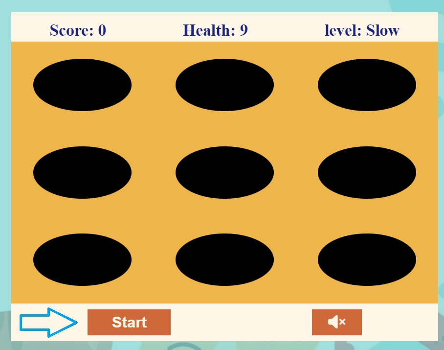

# [PAWS AND CLAWS](https://wafia7510.github.io/paws-and-claws)

"Paws and Claws" aims to provide an entertaining and engaging gaming experience that combines simplicity with a challenge. The project seeks to:
- Deliver Fun and Engagement: Create a game that players can enjoy in their free time, offering a light-hearted and stress-relieving experience.
- Improve Reaction Skills: Through its click-based gameplay, the game helps players enhance their reaction times and hand-eye coordination.
- Provide a Flexible Challenge: With three difficulty levels, the game caters to different skill levels, allowing players to play on different speed.
#### Target Audience
- Casual Gamers: Individuals looking for a quick and enjoyable game to play during breaks or in their leisure time.
- Animal Lovers: People who enjoy games featuring animals, particularly those who have a fondness for cats and dogs.
- Players of All Ages: The simple mechanics and charming theme make the game accessible to a broad age range, from children to adults.

#### Usefulness for the Target Audience
This game is designed to be a fun and easy-to-play game that provides:

- Entertainment: A quick, enjoyable way to unwind and pass the time.
- Skill Improvement: By requiring players to quickly react and make decisions, the game helps improve cognitive and motor skills.
- Accessibility: The game's simplicity and web-based deployment ensure that it can be easily accessed and played by anyone, anywhere, without the need for complex controls or high-end devices.

source: [amiresponsive](https://ui.dev/amiresponsive?url=https://wafia7510.github.io/paws-and-claws)

## UX
The design of "Paws and Claws" was centered around creating an intuitive and enjoyable user experience. The process involved:

- User-Centered Concept: The game was meticulously crafted to be inclusive, with a design that is both simple and engaging. Clear objectives and easy-to-understand mechanics were chosen to ensure that the gameplay was accessible to a wide audience, making it possible for anyone to pick up and play without the need for a tutorial.
- Visual Design: To appeal to people of all ages, a playful and bright visual theme was chosen.  Animal characters  such as cats and dogs are used to add the game's charm and relatability.
- Responsive Interaction: The game was designed to be responsive and fluid, with smooth animations and quick feedback on user interactions.
- Difficulty Levels: To cater to a diverse range of skill levels, three difficulty modes (Slow, Medium, Fast) were implemented. This allows players to play this game on different speed.
- Continuous Iteration: The design was refined through user feedback, focusing on balancing the challenge and ensuring the game remains fun and accessible across all difficulty levels.
This design process ensured that "Paws and Claws" offers a fun, user-friendly, and engaging experience for all players

### Colour Scheme

- `rgba(26, 35, 126, 1)` used for primary text.
- `oldlace` used for primary highlights.
- `rgb(238, 181, 75)` background color used for game display.
- `black` background color used for showing holes on game.
- `#cf683b` used button background.

The color scheme for "Paws and Claws" was chosen based on personal taste, aiming to create a visually appealing and playful aesthetic. The colors were selected to evoke a sense of fun and warmth, aligning with the light-hearted nature of the game. By using a palette that felt intuitive and pleasing, the goal was to enhance the overall user experience and make the game visually engaging for players of all ages.

### Typography

For the typography in "Paws and Claws," a combination of fonts was chosen to ensure readability and a clean aesthetic:

- Arial, Helvetica, and sans-serif  was used for the primary headers.

- Lucida Sans and Lucida Sans Regular was used for all other secondary text.

- [Font Awesome](https://fontawesome.com) icons were used in a game , such as the volume high and mute  icons in the button.

## Features

- **Start Button-#1**

    - Purpose: The Start button initiates the game, allowing the player to begin the challenge.
    - Value to User: This feature provides a clear entry point for the game, making it easy for users to start playing immediately. It ensures that the user feels in control of when the game begins, enhancing the user experience by offering a straightforward and user-friendly interface.

- **Restart Button-#2**

    - Purpose: The Restart button allows players to reset the game and start over from the beginning.
    - Value to User: This feature is crucial for users who want to try again without reloading the page. It offers convenience and quick access to replay the game, which is especially important for improving scores or adjusting strategies.

- **Scoreboard-#3**

    - Purpose: The scoreboard displays the current score, health, and difficulty level during gameplay.
     - Value to User: The scoreboard provides real-time feedback, helping players keep track of their progress. This feature is essential for maintaining engagement, as it shows how well the player is performing and what they need to achieve to reach the next milestone.
  

- **Health Indicator-#4**
    - Purpose: The health indicator shows the player's remaining health, which decreases when the player accidentally clicks on a dog.
    - Value to User: This feature adds a layer of challenge and urgency to the game. It helps players understand the consequences of their actions, encouraging them to be more precise in their gameplay to avoid losing health and ultimately, the game.

- **Level Display-#5**
    - Purpose: The level display indicates the current difficulty level (Slow, Medium, Fast) during the game.
    - Value to User: By clearly showing the current difficulty, this feature allows players to understand the level of challenge they are facing. It also helps in managing player expectations as the game speeds up, making it easier to gauge their performance.

- **Winning Screen-#6**
    - Purpose: The winning screen appears when a player reaches a score of 100 points, signaling a successful completion of the game.
    - Value to User: This feature provides a sense of accomplishment and closure. It rewards players for their skill and persistence, giving them a clear goal to strive for, which enhances the overall gaming experience.

- **Game over Screen-#7**
    - Purpose: The game over screen is displayed when the player's health reaches zero, ending the game.
    - Value to User: The game over screen serves as feedback that the game has ended, providing a natural stopping point. It also encourages players to try again and improve, contributing to the game's replayability and challenge.

- **Volume on and off toggle button-#8**
    - Purpose: The Volume On/Off toggle button allows players to control the game's audio, enabling or disabling sound effects during gameplay.
    - Value to User: This feature gives players the flexibility to play the game in different environments without disturbing others or, alternatively, to enjoy the full experience with sound. It enhances user control over their gaming experience, catering to individual preferences.

- **Instructions-#9**
    - Purpose: The Instructions section provides clear guidance on how to play the game, including how to start, score points, avoid losing health, and progress through levels.
   - Value to User: This feature is crucial for new players as it offers a clear understanding of the game mechanics, ensuring that users can quickly learn how to play and enjoy the game. Well-structured instructions improve the accessibility of the game, making it easier for a broader audience to engage.

- **Score-#10**
    - Purpose: The score indicates the current score during game which increases when player clicks cat.
   - Value to User: This feature provides a sense of accomplishment and closure. 

### Future Features

- Additional Levels:-#1
    - Potential to add more levels or challenges to keep players engaged..
- Power-ups and Bonuses:-#2
    - Introducing power-ups that can either help players by increasing their score or health, or introduce temporary challenges.
- Leaderboard:-#3
    - Implementing a leaderboard feature to allow players to compare scores.
.

## Tools & Technologies Used
-  used to generate README and TESTING templates.
-  used for version control. (`git add`, `git commit`, `git push`)
-  used for secure online code storage.
-  used as a cloud-based IDE for development.
-  used for the main site content.
-  used for the main site design and layout.
-  used for user interaction on the site.
-  used for hosting the deployed front-end site.
-  used for the icons.
-  used to help debug, troubleshoot, and explain things.

## Testing

> [!NOTE]  
> For all testing, please refer to the [TESTING.md](TESTING.md) file.

## Deployment

The site was deployed to GitHub Pages. The steps to deploy are as follows:

- In the [GitHub repository](https://github.com/wafia7510/paws-and-claws), navigate to the Settings tab 
- From the source section drop-down menu, select the **Main** Branch, then click "Save".
- The page will be automatically refreshed with a detailed ribbon display to indicate the successful deployment.

The live link can be found [here](https://wafia7510.github.io/paws-and-claws)

### Local Deployment

This project can be cloned or forked in order to make a local copy on your own system.

#### Cloning

You can clone the repository by following these steps:

1. Go to the [GitHub repository](https://github.com/wafia7510/paws-and-claws) 
2. Locate the Code button above the list of files and click it 
3. Select if you prefer to clone using HTTPS, SSH, or GitHub CLI and click the copy button to copy the URL to your clipboard
4. Open Git Bash or Terminal
5. Change the current working directory to the one where you want the cloned directory
6. In your IDE Terminal, type the following command to clone my repository:
	- `git clone https://github.com/wafia7510/paws-and-claws.git`
7. Press Enter to create your local clone.

Alternatively, if using Gitpod, you can click below to create your own workspace using this repository.

Please note that in order to directly open the project in Gitpod, you need to have the browser extension installed.
A tutorial on how to do that can be found [here](https://www.gitpod.io/docs/configure/user-settings/browser-extension).

#### Forking

By forking the GitHub Repository, we make a copy of the original repository on our GitHub account to view and/or make changes without affecting the original owner's repository.
You can fork this repository by using the following steps:

1. Log in to GitHub and locate the [GitHub Repository](https://github.com/wafia7510/paws-and-claws)
2. At the top of the Repository (not top of page) just above the "Settings" Button on the menu, locate the "Fork" Button.
3. Once clicked, you should now have a copy of the original repository in your own GitHub account!

### Local VS Deployment

When developing Paws and claws, two key environments were utilized: the local development setup and the live deployment on GitHub Pages. Each environment plays a crucial role in the development and presentation of the site.
**Local Version:**
Local provides a flexible and iterative workflow, enabling developers to address issues and refine features efficiently. This environment is ideal for fine-tuning design and functionality before going live.

**Deployment:**
Deployment ensures that the site is accessible globally, providing a polished and consistent user experience. It also allows for performance optimization and user feedback collection, reflecting the site’s performance in a real-world setting.

## Credits

In developing the Paws and Claws game, various resources were used to enhance content, design, and functionality. Here is a list of the sources and tools that contributed to the project:

- **Pinterest**: Provided high-quality photos used in the game.
- **ChatGPT:** For generating content, including text descriptions and feature explanations, as well as providing coding guidance.
- **W3Schools:** For web development tutorials and reference materials on HTML, CSS, and JavaScript.
**Unsplash:** Supplied high-resolution images that were utilized to enrich the visual appeal of the site. 
- **Pixabay:** Provided additional free images and illustrations to enhance the website's content. Pixabay.
- **Youtube:** Watched tutorials for game development and ideas.

### Content

| Source | Location | Notes |
| --- | --- | --- |
| [Markdown Builder](https://tim.2bn.dev/markdown-builder) | README and TESTING | tool to help generate the Markdown files |
| [W3Schools](https://www.w3schools.com/js/js_htmldom_elements.asp) | DOM for game | How to use DOM Elements |
| [W3Schools](https://www.w3schools.com/js/js_timing.asp) | Timing Function| JS timing |
| [W3Schools](https://www.w3schools.com/js/js_timing.asp) | setInterval function | how to use setInterval function |
| [W3Schools](https://www.w3schools.com/js/js_callback.asp) | CallBack| JS call back |
| [YouTube](https://www.youtube.com/watch?v=ej8SatOj3V4) | Whack a mole game  | for idea and practice |
| [YouTube](https://www.youtube.com/watch?v=toNFfAaWghU) | practice vanilla js | tutorial for making game |
| [ChatGPT](https://chatgpt.com/) | Audio control with regular buttons| How audio can be controlled using normal buttons |

### Media

| Source | Location | Type | Notes |
| --- | --- | --- | --- |
| [Pinterest](https://www.pinterest.co.uk/) | entire site | image | background image |
| [Unsplash](https://unsplash.com) | product page | image | sample of fake products |
| [Pixabay](https://pixabay.com) | whacking cat and | images | for displaying images |
| [Free Sound](https://freesound.org/browse/tags/?f=tag:%22game-sound%22) | game page | audio | free audio files to generate the game sounds |
| [TinyPNG](https://tinypng.com) | entire site | image | tool for image compression |

### Acknowledgements

- I would like to thank my Code Institute mentor, [Tim Nelson](https://github.com/TravelTimN) for his support throughout the development of this project.
- I would like to thank the [Code Institute](https://codeinstitute.net) tutor team for their assistance with troubleshooting and debugging some project issues.
- I would like to thank the [Code Institute Slack community](https://code-institute-room.slack.com) for the moral support; it kept me going during periods of self doubt and imposter syndrome.
- I would like to thank my parents, for believing in me, and allowing me to make this transition into software development.

