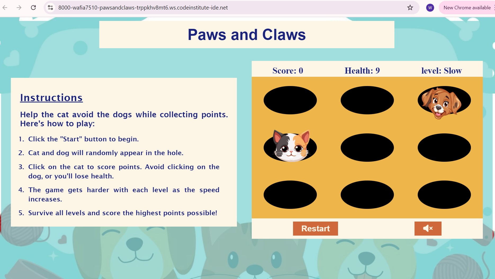
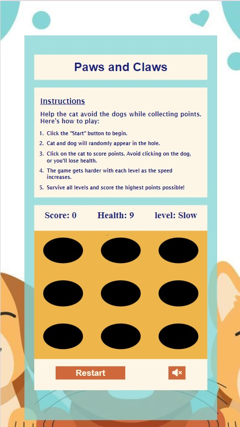

# Testing

> [!NOTE]  
> Return back to the [README.md](README.md) file.

Thorough testing was conducted to ensure that all features of the "Paws and Claws" game work as intended. This section details the feature-by-feature testing, user experience testing, compatibility testing, and the steps taken to address any issues that arose.
## Feature-by-Feature Testing
1. **Navigation**
- Functionality: The game has minimal navigation, primarily focused on starting, restarting, and navigating between game states (e.g., game over, winning screen).
- Testing Process:Verified that the "Start" button correctly initiates the game.
Confirmed that the "Restart" button successfully resets the game state, allowing the player to start over from the beginning.Checked transitions between the main game screen, the winning screen (when the player reaches 100 points), and the game-over screen (when the player's health reaches zero).
- Result: Navigation between game states is smooth, and buttons function as intended, providing a straightforward user experience.

2. **Responsive Design**
- Functionality: The game was designed to be responsive, adjusting its layout across various screen sizes.
- Testing Process:Tested the game on different devices, including desktops, tablets, and mobile phones.Verified that all game elements (images, buttons, score display) adjust correctly on screens with different resolutions.
Used media queries to address specific layout issues when the screen width exceeds 720px.
- Result: The game performs well across various devices, with minor issues noted and addressed where possible.

3. Scoreboard and Levels
- Functionality: The scoreboard displays the player's current score, health, and level. The level increases as the game progresses.
- Testing Process:
Played through the game to ensure that the score, health, and level values update correctly during gameplay.Verified that the game transitions to the next level as intended when certain score thresholds are met.
- Result: The scoreboard and level functionality work as expected, accurately reflecting the player's progress in the game.

4. Instructions and Game Rules
- Functionality: The game includes clear instructions that explain how to play.
- Testing Process:Reviewed the instructions to ensure they are clear, concise, and easy to follow.Ensured that the instructions match the actual game mechanics.
- Result: The instructions effectively guide new players, aligning with the game's design and rules.

5. Volume On/Off Toggle
- Functionality: Players can toggle game sound on or off during gameplay.
- Testing Process:Tested the volume toggle button to confirm that it mutes and unmutes game sounds.
Ensured that the toggle state persists correctly when the game is restarted.
- Result: The volume toggle button works as intended, giving users control over game audio.

## User Experience Testing
1. Usability Testing
- Process: Several users were asked to play the game and provide feedback on the overall experience.
- Observations:Players found the game easy to understand and play.No major usability issues were reported, though minor layout improvements were suggested.
- Resolutions: Implemented minor layout adjustments based on user feedback to enhance the gaming experience.
2. Accessibility Testing
- The game was tested for basic accessibility features.
- Verified that all text elements are readable, with sufficient contrast against the background.
Checked that game instructions and buttons are accessible.Ensured that images have appropriate alt text where applicable.
- The game meets basic accessibility standards, ensuring a wider audience can enjoy it.
## Compatibility Testing
1. Browser Compatibility
The game was tested across various browsers, including Chrome, Firefox, and Opera.
Result: The game functions consistently across all tested browsers, with no significant performance differences.
2. Device Compatibility
The game was tested on a range of devices, including laptops, tablets, and mobile phones.
As noted in the "Unfixed Bugs" section, some issues were observed with image display on tablet screens.Other device types displayed the game correctly, with responsive design adjustments working as intended.
-The game is compatible with most devices, with some issues pending tablet resolution.

## Regression Testing
Process: After fixing layout issues and implementing minor improvements, regression testing was conducted to ensure that previous features continued to function correctly.
Result: All core features, including navigation, scoring, and level progression, were retested and confirmed to work as expected, with no new issues introduced.
## Documentation and Logs
Process: A detailed record of the testing procedures, results, and any bugs encountered was maintained throughout the development process.
Result: This documentation provides a clear history of the testing process, including how issues were identified and resolved.
## User Feedback Incorporation
Process: Feedback from users during testing was taken into account to make final adjustments to the game's layout and usability.
Result: Incorporating user feedback helped refine the game’s design, resulting in a more polished and user-friendly final product.

## Code Validation

### HTML

I have used the recommended [HTML W3C Validator](https://validator.w3.org) to validate all of my HTML files.

| Directory | File | Screenshot | Notes |
| --- | --- | --- | --- |
|  | index.html |  | |

### CSS

I have used the recommended [CSS Jigsaw Validator](https://jigsaw.w3.org/css-validator) to validate all of my CSS files.

| Directory | File | Screenshot | Notes |
| --- | --- | --- | --- |
| assets | style.css |  | |

### JavaScript

I have used the recommended [JShint Validator](https://jshint.com) to validate all of my JS files.

| Directory | File | Screenshot | Notes |
| --- | --- | --- | --- |
| assets | script.js |  | |

## Browser Compatibility

I've tested my deployed project on multiple browsers to check for compatibility issues.

| Browser | Home | Notes |
| --- | --- | --- |
| Chrome |   | Works as expected |
| Firefox |  | Works as expected |
| Opera | | Minor differences |

## Responsiveness

I've tested my deployed project on multiple devices to check for responsiveness issues.

| Device | Home | Notes |
| --- | --- | --- |
| Mobile (DevTools) |  | Works as expected |
| Tablet (DevTools) |  | Works as expected |
| Desktop |  | Works as expected |

## Lighthouse Audit

I've tested my deployed project using the Lighthouse Audit tool to check for any major issues.

| Page | Mobile | Desktop | Notes |
| --- | --- | --- | --- |
| Home |  |  | Some minor warnings |

## Defensive Programming

| Page | User Action | Expected Result | Pass/Fail | Comments |
| --- | --- | --- | --- | --- |
| Home | | | | |
| | Click on cat and dog |  the game ensures that only valid clicks on cats or dogs are processed, and any erroneous inputs (like clicks outside the intended area) are ignored or handled appropriately. | Pass | This prevents the game from crashing or behaving unpredictably due to invalid inputs, thereby improving the overall stability of the game.|
| | Displaying images on holes |  try-catch blocks are used to handle potential runtime errors | Pass | It helps maintain a smooth gaming experience|
|  | Clicking Toggle sound button |  change icon font when clicked one and produce a sound when player clicks on cat and dog | Pass | It helps maintain a smooth gaming experience|
|  | Boundary checks are implemented |  the game does not allow the score to exceed a certain value or the health to drop below zero without triggering appropriate game-over or winning conditions. | Pass |  This prevents illogical states in the game, such as negative health or scores|
|  | Testing was conducted to identify potential edge cases and bugs| the game has been designed to handle most common scenarios effectively.| Pass |  This practice ensures that the game is as reliable as possible before release, with known issues documented and prioritized for future fixes.|

## Bugs

- **When the screen width exceeds 720px**, some elements on the screen start to misalign, affecting the layout and overall user experience.I implemented two different media queries to address this issue, which has improved the layout somewhat. However, the solution is not perfect, and some minor alignment issues still persist at certain screen sizes.
- **An unknown error occasionally appears in the browser's console**. Despite efforts to debug and fix this issue, I have been unable to identify the exact cause or resolve the error.The error does not seem to significantly affect the game’s functionality or performance, but it remains an unresolved issue that needs further investigation.
- **When the game is viewed on different devices**, specifically when switching from a mobile to a tablet screen size, the images (such as characters and other graphical elements) behave inconsistently. They might resize or reposition in unexpected ways, leading to a disrupted visual experience.To address this issue, I plan to implement additional media queries explicitly tailored for tablet screen sizes to ensure a consistent and responsive layout across all devices.

## Unfixed Bugs

- Due to the unavailability of a tablet device for testing, I was unable to fully address certain errors related to how **images display within the holes class** when viewed on tablet screens. The images might not align properly or could behave unexpectedly when the game is played on a tablet.This issue might affect the visual consistency of the game on tablets, but it doesn't impact the core functionality. Future testing on a tablet is needed to identify and resolve these alignment issues.
- While **validating the JavaScript file**, some warnings were noted, such as 'let' is available in ES6 (use 'esversion: 6') or Mozilla JS extensions (use moz). These warnings indicate that the code uses features available in newer versions of JavaScript.These warnings have not been fixed, as they do not affect the functionality of the game. The game runs as expected, and addressing these warnings would require adjusting the JavaScript version settings, which is unnecessary for the current scope of the project.

> [!NOTE]  
> There are no remaining bugs that I am aware of.
